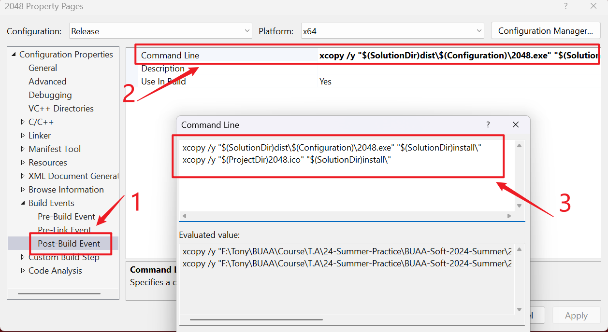

# 2048 Game Demo

> Copyright &copy; Tony's Studio 2024

---

## 编译运行

在 Visual Studio（推荐 Visual Studio 2022）中打开项目，构建解决方案或工程即可。

构建时，可以选择配置（Configuration），有 Debug 和 Release 两种。

最后，点击运行即可，也可以跳过前两步，直接运行。左侧为调试运行（可以打断点），右侧为非调试运行。

## 打包发布

> 这一步需要你本地有 [Inno Setup](https://jrsoftware.org/isinfo.php)。

**在 Release 配置下**，项目有“构建后事件”（Post-Build Event），会将可执行文件和图标拷贝至安装脚本目录（`install\`）。

接下来，打开 `install` 目录中的 `Setup.iss` 脚本，点击 Build > Compile 编译构建我们的安装包。

构建完成后，即可在 `install\` 目录中得到 `2048 Setup.exe`，即我们的安装包。

